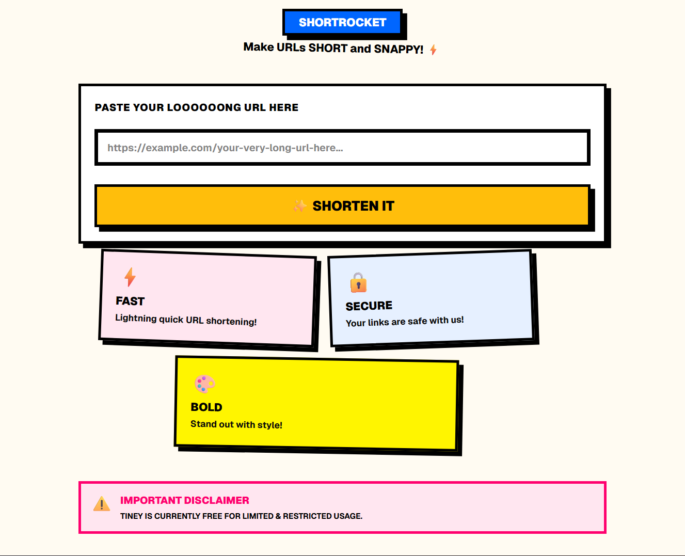

# ShortRocket 🚀

> Make URLs SHORT and SNAPPY!



## Features

- Shorten any long URL instantly
- Copy shortened URL to clipboard
- QR code generation for every short link
- URLs expire after 7 days
- Redis caching for fast redirects
- Load balanced across 3 server instances via Nginx

## Tech Stack

**Frontend:** React, Redux Toolkit, TypeScript, Tailwind CSS, Vite

**Backend:** Fastify, Node.js, TypeScript

**Infrastructure:** Docker Compose, Nginx, MongoDB, Redis, Zookeeper

## Running Locally

```bash
docker-compose up --build
```

Then open [http://localhost:5173](http://localhost:5173)

## What's Next

- Analytics page — click counts, last accessed, history
- User authentication & personal dashboard
- Custom short codes
- URL management (delete, edit expiry)
